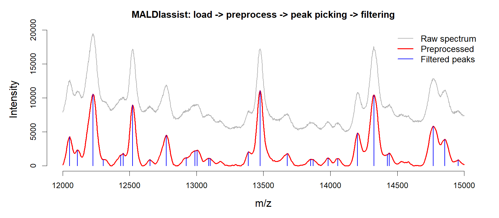
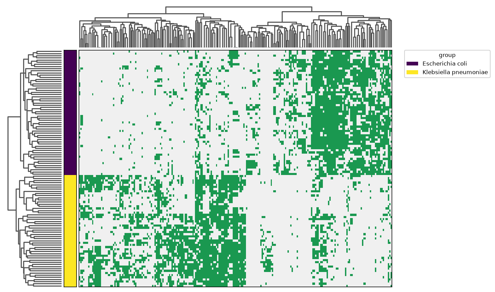

# maldiassist (Python)

> Python package **v1.0.0** · Original R package: [hiows/MALDIassist](https://github.com/hiows/MALDIassist) (v1.0.0)

**maldiassist** is a Python port of the [MALDIassist](https://github.com/hiows/MALDIassist) R package
(v1.0.0, R + Rcpp/C++). It reproduces the **same algorithms and numerical results** within
floating-point tolerance. The workflow covers the full path from raw Bruker spectra to a
cohort-level peak matrix:

- Loading Bruker MALDI-TOF spectra
- Smoothing and baseline correction
- Gaussian KDE-based peak detection (including shoulder peaks)
- Peak-quality metrics and filtering (intensity / prominence / strength)
- Spectrum alignment to internal standards (linear / lowess)
- Cohort feature analysis (frequent m/z discovery, matched peak matrix, two-group significance testing)
- Visualization (matplotlib)

Performance-critical kernel-regression routines are implemented in C++ (via
[nanobind](https://github.com/wjakob/nanobind), a direct port of the original Rcpp core).

## Example

The figure below shows the core workflow on real Bruker MALDI-TOF data: a raw spectrum (gray)
is smoothed and baseline-corrected (red), then peaks are detected and filtered (blue).



---

## Installation

Requires Python 3.9+.

The package ships a small C++ extension (a nanobind port of the original Rcpp
kernel-regression core) that accelerates peak detection. Pre-built **wheels**
bundle this extension, so no compiler is needed:

```bash
pip install maldiassist
pip install "maldiassist[viz]"   # with visualization (matplotlib)
```

Alternatively, install a pre-built wheel from the
[GitHub Releases](https://github.com/hiows/MALDIassist-py/releases) page, or
build from source (requires a C++17 compiler and CMake, handled automatically
by `scikit-build-core`):

```bash
pip install "git+https://github.com/hiows/MALDIassist-py.git"
```

> The C++ extension is optional at runtime: if it cannot be imported the package
> transparently falls back to the pure-Python implementation, producing identical
> results (just slower).

For development (clone first, then editable install):

```bash
git clone https://github.com/hiows/MALDIassist-py.git
cd MALDIassist-py
pip install -e .              # core (numpy, scipy, pandas) + C++ extension
pip install -e ".[viz]"       # with visualization (matplotlib)
pip install -e ".[viz,test]"  # visualization + test tooling
```

The original R package can be installed from GitHub (CRAN submission pending):

```r
# install.packages("remotes")
remotes::install_github("hiows/MALDIassist")
```

---

## Quick start

The pipeline follows six steps: **load → preprocess → KDE → peak picking → peak filtering → visualization**.

```python
import maldiassist as ma
```

### 1. Load

Point `load_maldi_spectra()` at a directory of Bruker flex data files. It returns a
name-keyed dict of raw spectra.

```python
raw_spectra = ma.load_maldi_spectra("data/")
```

### 2. Preprocess

Apply Savitzky-Golay smoothing and baseline subtraction.

```python
preprocessed_spectra = ma.preprocess_maldi_spectra(
    raw_spectra,
    hws_sg=10,           # half-window size for Savitzky-Golay
    pno_sg=3,            # polynomial order
    baseline_type="snip",  # baseline algorithm
    iter_snip=50,        # SNIP iterations
)
```

Build Gaussian KDE spectra for peak filtering:

```python
kde_spectra = ma.build_kde_spectra(preprocessed_spectra, bw=1)
kde_spectrum_only = {k: v["spectrum"] for k, v in kde_spectra.items()}
```

### 3. Peak picking

`find_peaks_spectra()` detects peaks (including shoulder peaks) using a Gaussian KDE approach.

```python
peaks_list = ma.find_peaks_spectra(
    preprocessed_spectra,
    bw=1,                          # KDE bandwidth
    hws_peaks=10,
    weight_type="raw",
    cutoff_kappa_peak_strength=0.3,
    peak_retention_fraction=0.25,
)
```

### 4. Peak filtering

`filter_peaks_spectra()` removes low-quality peaks by intensity, prominence, and strength cutoffs.
Pass the **KDE spectra** (not the preprocessed spectra) as the `spectra` argument, matching the R API.

```python
filtered_peaks_list = ma.filter_peaks_spectra(
    kde_spectrum_only,
    peaks_list,
    cutoff_peak_intensity=100,
    cutoff_peak_prominence=50,
    cutoff_peak_strength=0.5,
    normalization_type="raw",
)
```

### 5. Visualization

Overlay a raw spectrum (gray), its preprocessed version (red), and the filtered peaks (blue)
in the same style as the Example figure (requires the `[viz]` extra). The exact spectrum
depends on your `data/` directory and which sample is selected.

```python
import matplotlib.pyplot as plt

example_range = (12000, 15000)
sample = next(iter(raw_spectra))
spec = raw_spectra[sample]
pp = preprocessed_spectra[sample]
fp = filtered_peaks_list[sample]

lo, hi = example_range
x_raw = spec.loc[(spec["mz"] >= lo) & (spec["mz"] <= hi), "mz"]
y_raw = spec.loc[(spec["mz"] >= lo) & (spec["mz"] <= hi), "intensity"]
x_pp = pp.loc[(pp["mz"] >= lo) & (pp["mz"] <= hi), "mz"]
y_pp = pp.loc[(pp["mz"] >= lo) & (pp["mz"] <= hi), "intensity"]

fig, ax = plt.subplots()
ax.plot(x_raw, y_raw, color="gray", lw=1.5, label="raw")
ax.plot(x_pp, y_pp, color="red", lw=2, label="preprocessed")
fp_r = fp[(fp["mz"] >= lo) & (fp["mz"] <= hi)]
ax.vlines(fp_r["mz"], 0, fp_r["intensity"], color="blue", lw=1.5, label="peaks")
ax.set_xlabel("m/z")
ax.set_ylabel("Intensity")
ax.set_ylim(0, y_raw.max())
plt.show()
```

You can also overlay all spectra in a single plot:

```python
ma.visualize_spectra(preprocessed_spectra)
```

---

## Cohort analysis

The example below follows a two-species MALDI-TOF cohort from
[PRIDE PXD058284](https://www.ebi.ac.uk/pride/archive/projects/PXD058284): load Bruker spectra
and sample metadata, preprocess and pick peaks, align across samples, build a matched-peak
matrix, and test for group-discriminating m/z features.

### 1. Load spectra and metadata

```python
import pandas as pd

raw_spectra = ma.load_maldi_spectra("data/raw/")
metadata = pd.read_excel("data/sample_metadata.xlsx")

# two-level species grouping (one label per sample)
sample_group = metadata.set_index("SampleID").reindex(raw_spectra.keys())["Species"].to_numpy()
```

### 2. Preprocess, KDE, and peak picking

```python
preprocessed_spectra = ma.preprocess_maldi_spectra(
    raw_spectra,
    hws_sg=10,
    pno_sg=3,
    baseline_type="snip",
    iter_snip=50,
)

kde_spectra = ma.build_kde_spectra(preprocessed_spectra, bw=1)
kde_spectrum_only = {k: v["spectrum"] for k, v in kde_spectra.items()}

peaks_list = ma.find_peaks_spectra(
    preprocessed_spectra,
    bw=1,
    hws_peaks=10,
    weight_type="raw",
    cutoff_kappa_peak_strength=0.3,
    peak_retention_fraction=0.25,
)

filtered_peaks_list = ma.filter_peaks_spectra(
    kde_spectrum_only,
    peaks_list,
    cutoff_peak_intensity=100,
    cutoff_peak_prominence=50,
    cutoff_peak_strength=0.5,
    normalization_type="raw",
)
```

### 3. Align spectra

`align_spectra()` corrects m/z drift using internal standards selected from frequent,
high-intensity peaks. Choose `"linear"` (two-point) or `"lowess"` (multi-point) alignment.
It returns one aligned `spectrum` / `peaks` pair per sample (in `alignment_results`) plus
the reference `standard_mz` values used as anchors.

```python
aligned = ma.align_spectra(
    kde_spectrum_only,
    filtered_peaks_list,
    bin_width=20,
    alignment_mode="linear",  # or "lowess"
    hws_alignment=50,
)

aligned_peaks = {k: v["peaks"] for k, v in aligned["alignment_results"].items()}
exclude_mz = list(aligned["standard_mz"].values())  # alignment anchors, excluded below
```

### 4. Find frequent m/z values

`find_frequent_mz()` scans pooled peak m/z values across the aligned samples and refines each
bin location with Gaussian KDE. Pass the alignment anchors to `exclude_mz` so the internal
standards are dropped from the feature set.

```python
freq_mz = ma.find_frequent_mz(
    aligned_peaks,
    bin_width=20,
    exclude_mz=exclude_mz,
)
```

### 5. Build a matched peak matrix

`build_matched_matrix()` matches each sample's peaks to the frequent m/z references and
returns a detection matrix (`detected_matrix`) and a signed m/z-difference matrix
(`delta_mz_matrix`), both sample-by-marker.

```python
matched = ma.build_matched_matrix(
    aligned_peaks,
    reference_mz=freq_mz["mz"].to_numpy(),
    hws_match=10,
)

mat = matched["detected_matrix"]
```

Visualize the matrix with `heatmap_matched_matrix()`, optionally annotated by a per-sample
grouping (requires `[viz]`):

```python
ma.heatmap_matched_matrix(
    mat,
    group=sample_group,   # one entry per sample (row)
    hide_rownames=True,
    hide_colnames=True,
)
```

### 6. Test for significant m/z features

`estimate_significance()` runs a per-feature two-group comparison (t-test or Wilcoxon) on a
sample-by-marker matrix and returns raw and adjusted p-values. Subset the matrix to the
significant markers to highlight the discriminating features.

```python
sig = ma.estimate_significance(
    mat,
    group=sample_group,      # two-level grouping, one entry per sample
    stat_method="t.test",    # or "wilcox"
    adj_method="BH",         # "none", "BH", or "bonferroni"
)

sig_cols = sig.loc[sig["adj_pvalue"] < 0.01, "feat_names"]
ma.heatmap_matched_matrix(
    mat[sig_cols],
    group=sample_group,
    hide_rownames=True,
    hide_colnames=True,
)
```

Applied to the PXD058284 two-species cohort (*E. coli* vs *K. pneumoniae*), the significant
markers cleanly separate the samples by species:



---

## R/Python parity

The Python package was validated step-by-step against **MALDIassist** R v1.0.0 on the same
Bruker cohort and parameter set (Quick start / cohort analysis above). Summary:

| Step | Match |
| --- | --- |
| Loading / preprocessing / peak detection / filtering / alignment | m/z and intensity within ~5×10⁻¹¹ |
| `find_frequent_mz` | identical row count; count and freq_ratio exact |
| `build_matched_matrix` | detection matrix exact (difference 0) |
| `estimate_significance` | p-value difference ~10⁻¹⁶; R and Python agree on adj. p < 0.01 calls |

Core algorithmic details (Nadaraya–Watson kernel regression with 1st–3rd derivatives,
SNIP/TopHat baselines, Savitzky–Golay boundary coefficients, R `hist`/`pretty` binning,
R `lowess`, `p.adjust`, Wilcoxon continuity correction, etc.) are reproduced identically.

> Note: kernel summation is computed in the **same sequential accumulation order** as R's
> Rcpp loop. NumPy's default pairwise summation can introduce tiny floating-point
> differences over symmetric windows that flip tie-breaking in extremum selection.

### Performance

The kernel-regression hot paths (Gaussian KDE grid evaluation with 1st–3rd derivatives and
bisection root finding) are implemented in C++ via nanobind (`src/spectrum_math_cpp.cpp`, a
direct port of the original Rcpp `spectrum_math.cpp`). The compiled backend uses the identical
sequential summation order as the pure-Python reference, so results match to floating-point
tolerance while running substantially faster. When the extension is unavailable,
`maldiassist.spectrum_math` falls back to the pure-Python path automatically. Set
`MALDIASSIST_DISABLE_CPP=1` to force the pure-Python backend (used by the parity tests in
`tests/test_kde_parity.py`).

---

## Main functions

| Function | Purpose |
| --- | --- |
| `load_maldi_spectra()` | Load Bruker raw spectra from a directory |
| `preprocess_maldi_spectra()` | Smooth and baseline-correct spectra |
| `find_peaks()` / `find_peaks_spectra()` | Detect ordinary and shoulder peaks (single / dict) |
| `find_peaks_fast()` / `find_peaks_spectra_fast()` | Fast local peak detection (single / dict) |
| `filter_peaks()` / `filter_peaks_spectra()` | Filter peaks by intensity, prominence, and strength |
| `build_kde_spectrum()` / `build_kde_spectra()` | Build Gaussian KDE spectra (single / dict) |
| `find_frequent_mz()` | Find frequent m/z values across a cohort |
| `align_spectra()` | Align spectra to internal standards (linear / lowess) |
| `build_matched_matrix()` | Assemble a cohort peak intensity matrix |
| `estimate_significance()` | Two-group significance testing per m/z feature |
| `visualize_spectrum()` / `visualize_spectra()` | Visualize spectra with matplotlib (requires `[viz]`) |
| `heatmap_matched_matrix()` | Heatmap of a matched-peak matrix (requires `[viz]`) |

### Correspondence with the R package

| Step | R function | Python function |
| --- | --- | --- |
| Loading | `load_maldi_spectra` | `load_maldi_spectra` |
| Preprocessing | `preprocess_maldi_spectra` | `preprocess_maldi_spectra` |
| KDE | `build_kde_spectrum` / `build_kde_spectra` | `build_kde_spectrum` / `build_kde_spectra` |
| Peak detection | `find_peaks` / `find_peaks_spectra` | `find_peaks` / `find_peaks_spectra` |
| Peak filtering | `filter_peaks` / `filter_peaks_spectra` | `filter_peaks` / `filter_peaks_spectra` |
| Alignment | `align_spectra` | `align_spectra` |
| Frequent m/z | `find_frequent_mz` | `find_frequent_mz` |
| Matched matrix | `build_matched_matrix` | `build_matched_matrix` |
| Significance test | `estimate_significance` | `estimate_significance` |
| Visualization | `visualize_spectrum/spectra`, `heatmap_matched_matrix` | `visualize_spectrum/spectra`, `heatmap_matched_matrix` |

---

## Author

**Wonseok Oh** ([ORCID: 0009-0002-0687-8466](https://orcid.org/0009-0002-0687-8466))

## How to cite

If you use **maldiassist** in your research, please cite the underlying MALDIassist software.
From R you can run:

```r
citation("MALDIassist")
```

A BibTeX entry:

```bibtex
@Manual{maldiassist,
  title  = {MALDIassist: Mathematical Utilities for MALDI-TOF Mass Spectrometry},
  author = {Wonseok Oh},
  year   = {2026},
  note   = {R package version 1.0.0; Python port version 1.0.0},
  url    = {https://github.com/hiows/MALDIassist},
  doi    = {10.5281/zenodo.21307258}
}
```

Archived on Zenodo: [10.5281/zenodo.21307258](https://doi.org/10.5281/zenodo.21307258).
To cite the software regardless of version, use the concept DOI
[10.5281/zenodo.21219451](https://doi.org/10.5281/zenodo.21219451).

## License

MIT © 2026 Wonseok Oh. See [LICENSE](LICENSE) for details.

This project is a Python port of the [MALDIassist](https://github.com/hiows/MALDIassist)
R package (v1.0.0), which is also released under the MIT License (© 2026 Wonseok Oh).
