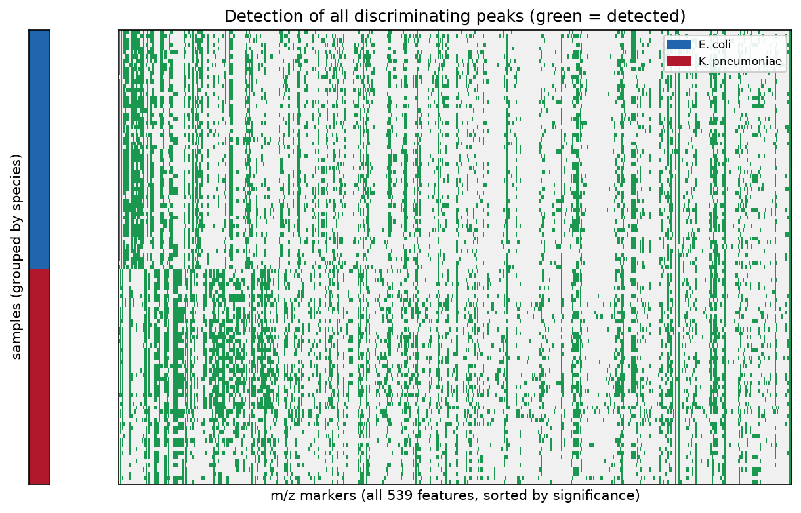
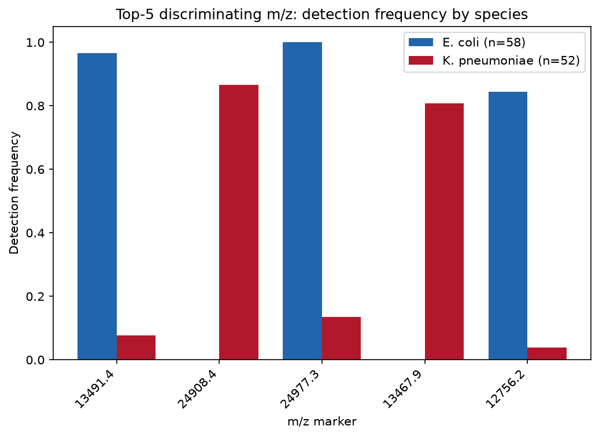

# maldiassist (Python)

> Python package **v0.2.2** · Original R package: [hiows/MALDIassist](https://github.com/hiows/MALDIassist) (v0.1.3)

A pure-Python port of the `MALDIassist` R package (0.1.3, R + Rcpp/C++) that reproduces
the **same algorithms and numerical results**. It provides the same five-step workflow as
the original: Bruker Flex raw-data loading, preprocessing, kernel-regression peak detection,
peak metrics/filtering, cohort analysis (alignment, frequent m/z, matched matrix,
significance testing), and visualization.

Step-by-step results were validated against ground truth generated by actually running the
original R package, achieving an **exact match** within floating-point tolerance on the
TestData set.

## Installation

Requires Python 3.9+.

The package ships a small C++ extension (a nanobind port of the original Rcpp
kernel-regression core) that accelerates peak detection. Pre-built **wheels**
bundle this extension, so no compiler is needed:

```bash
# once published to PyPI (recommended)
pip install maldiassist
pip install "maldiassist[viz]"   # with visualization (matplotlib)
```

Until the PyPI release, install a pre-built wheel from the GitHub Releases page,
e.g.:

```bash
pip install "maldiassist @ https://github.com/hiows/MALDIassist-py/releases/latest/download/<wheel-file>.whl"
```

Installing from source (git or sdist) instead requires a C++17 compiler and CMake
(handled automatically by `scikit-build-core`):

```bash
pip install "git+https://github.com/hiows/MALDIassist-py.git"
```

> The C++ extension is optional at runtime: if it cannot be imported the package
> transparently falls back to the pure-Python implementation, producing identical
> results (just slower).

For development (clone first, then editable install):

```bash
git clone https://github.com/hiows/MALDIassist-py.git
cd MALDIassist-py
pip install -e .              # core (numpy, scipy, pandas) + C++ extension
pip install -e ".[viz]"       # with visualization (matplotlib)
pip install -e ".[viz,test]"  # visualization + test tooling
```

## Correspondence with the original

| Step | R function | Python function |
| --- | --- | --- |
| Loading | `load_maldi_spectra` | `load_maldi_spectra` |
| Preprocessing | `preprocess_maldi_spectra` | `preprocess_maldi_spectra` |
| Peak detection | `find_peaks` / `find_peaks_spectra` | `find_peaks` / `find_peaks_spectra` |
| Peak filtering | `filter_peaks` / `filter_peaks_spectra` | `filter_peaks` / `filter_peaks_spectra` |
| Alignment | `align_spectra` | `align_spectra` |
| Frequent m/z | `find_frequent_mz` | `find_frequent_mz` |
| Matched matrix | `build_matched_matrix` | `build_matched_matrix` |
| Significance test | `estimate_significance` | `estimate_significance` |
| Visualization | `visualize_spectrum/spectra`, `heatmap` | `visualize_spectrum/spectra`, `heatmap_matched_matrix` |

The core algorithmic details (Nadaraya–Watson kernel regression with 1st–3rd derivatives,
SNIP/TopHat baselines, Savitzky–Golay boundary coefficients, R `hist`/`pretty` binning,
R `lowess`, `p.adjust`, Wilcoxon continuity correction, etc.) are reproduced identically.

> Note: kernel summation is computed in the **same sequential accumulation order** as R's
> Rcpp loop. NumPy's default pairwise summation can introduce tiny floating-point
> differences over symmetric windows that flip tie-breaking in extremum selection.

### Performance

The kernel-regression hot paths (Gaussian KDE grid evaluation with 1st-3rd
derivatives and bisection root finding) are implemented in C++ via
[nanobind](https://github.com/wjakob/nanobind) (`src/spectrum_math_cpp.cpp`, a
direct port of the original Rcpp `spectrum_math.cpp`). The compiled backend uses
the identical sequential summation order as the pure-Python reference, so results
match to floating-point tolerance while running substantially faster. When the
extension is unavailable, `maldiassist.spectrum_math` falls back to the
pure-Python path automatically. Set `MALDIASSIST_DISABLE_CPP=1` to force the
pure-Python backend (used by the parity tests in `tests/test_kde_parity.py`).

## Usage (same workflow as the original)

```python
import numpy as np
import maldiassist as ma

# 1) Load Bruker raw spectra (fid/acqu -> m/z conversion, mixedsort naming)
raw = ma.load_maldi_spectra("TestData")

# 2) Preprocess: Savitzky-Golay smoothing + SNIP baseline removal
pp = ma.preprocess_maldi_spectra(
    raw, hws_sg=10, pno_sg=3, baseline_type="snip", iter_snip=100
)

# 3) Peak detection: NW-KDE curvature / shoulder based
peaks = ma.find_peaks_spectra(
    pp, bw=1.0, hws_peaks=10.0, weight_type="raw",
    cutoff_kappa_peak_strength=0.3,
)

# 4) Peak filtering: intensity / prominence / strength cutoffs
fpeaks = ma.filter_peaks_spectra(
    pp, peaks,
    cutoff_peak_intensity=100.0,
    cutoff_peak_prominence=100.0,
    cutoff_peak_strength=0.5,
    normalization_type="raw",
)

# 5) Cohort analysis
aligned = ma.align_spectra(
    pp, fpeaks, bin_width=20.0, alignment_mode="linear",
    freq_ratio_cutoff=0.9, hws_alignment=50.0,
)
aligned_peaks = {k: v["peaks"] for k, v in aligned["alignment_results"].items()}
exclude_mz = np.array(list(aligned["standard_mz"].values()))

freq = ma.find_frequent_mz(aligned_peaks, bin_width=20.0, exclude_mz=exclude_mz)

matched = ma.build_matched_matrix(
    aligned_peaks, reference_mz=freq["mz"].to_numpy(), hws_match=10.0
)
detected = matched["detected_matrix"]

# Two-group comparison (e.g. first 5 vs the rest)
group = np.array(["A"] * 5 + ["B"] * (detected.shape[0] - 5))
sig = ma.estimate_significance(
    detected, group, stat_method="t.test", adj_method="BH"
)
print(sig.head())
```

### Visualization (matplotlib, requires `[viz]`)

```python
sample = list(pp)[0]  # first sample name
ax = ma.visualize_spectrum(pp[sample], peaks=fpeaks[sample], annotate_topN=True, topN=5)
ax = ma.visualize_spectra(pp, interest_range=(13000, 20000))
ax = ma.heatmap_matched_matrix(detected, title="Matched peaks")
```

## Example: top-5 m/z discriminating K. pneumoniae from E. coli

`examples/find_discriminating_mz.py` builds the cohort feature matrix with the five-step
workflow above, then uses species labels to select the **top-5 m/z markers that discriminate
_Klebsiella pneumoniae_ from _Escherichia coli_** via a significance test (Wilcoxon, BH
correction).

> Reference data: this example follows the PRIDE dataset
> [PXD058284](https://www.ebi.ac.uk/pride/archive/projects/PXD058284) ("Clinical Evaluation
> of Advanced MALDI-TOF MS for Carbapenemase Subtyping in Gram-negative Isolates", CC0),
> Bruker flex MALDI-TOF spectra of carbapenemase-producing Enterobacterales.

```bash
pip install -e ".[viz]"
pip install openpyxl   # if the metadata is an xlsx file

python examples/find_discriminating_mz.py \
    --data-dir TestData \
    --meta metadata.xlsx \
    --out results
```

The metadata file just needs the **first column to be the sample name and the second column
to be the species name** (xlsx or csv). Raw spectra and the metadata (sample-to-species
mapping) are sensitive and are **not** included in this repository; provide your own Bruker
data and mapping file and point the paths at them.

Applied to a clinical-isolate cohort (_E. coli_ 58, _K. pneumoniae_ 52), the top-5 markers
clearly separate the two species.

**1) Detection heatmap of all markers** (all features, green = detected; individual sample names are hidden)



**2) Detection frequency by species** (top-5 markers, aggregated values)



## Reproducibility against the R ground truth

During development, the full TestData pipeline was run with the original R package to dump
per-step CSVs, and the Python results (same parameters) were compared step by step.

Summary on TestData:

- Loading / preprocessing / peak detection / filtering / alignment: m/z and intensity match
  within `~5e-11` (m/z representation error)
- `find_frequent_mz`: identical row count and counts; median-intensity difference `~4e-12`
- `build_matched_matrix`: detection matrix matches exactly (difference 0)
- `estimate_significance`: t-test / Wilcoxon p-value difference `~1e-16`

## License

MIT © 2026 Wonseok Oh. See [LICENSE](LICENSE) for details.

This project is a Python port of the [MALDIassist](https://github.com/hiows/MALDIassist)
R package (v0.1.3), which is also released under the MIT License (© 2026 Wonseok Oh).
