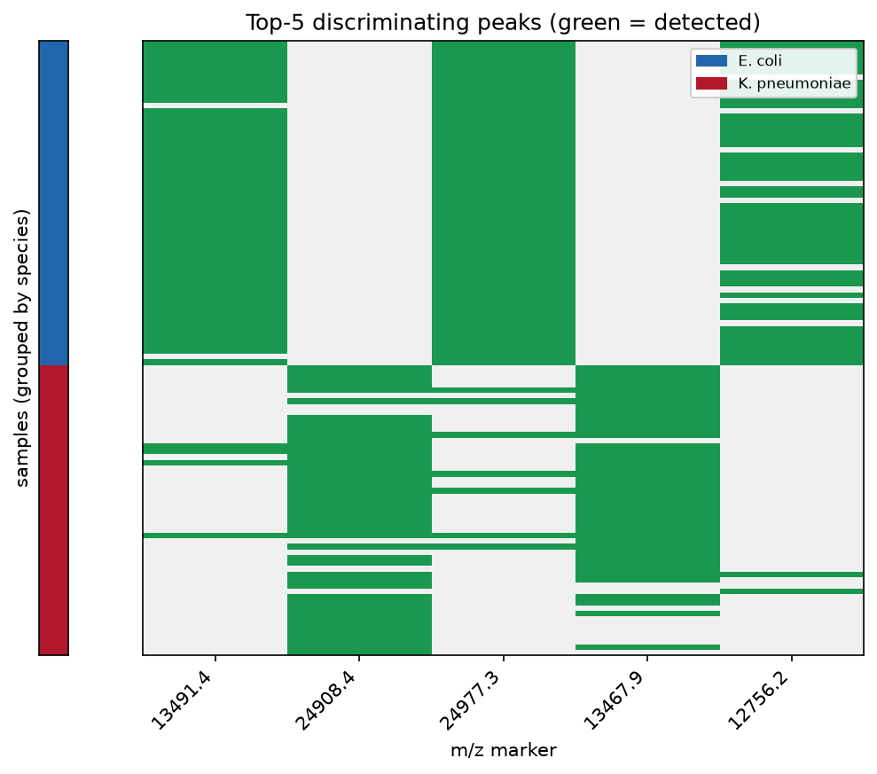
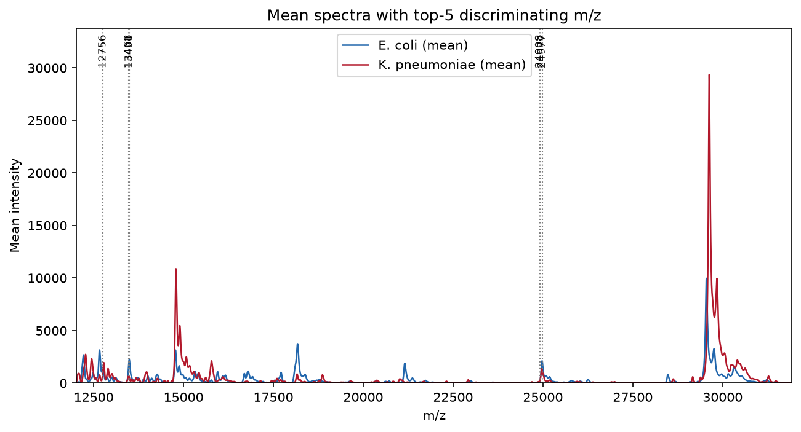

# maldiassist (Python)

> Python package **v0.1.0** · 원본 R 패키지: [hiows/MALDIassist](https://github.com/hiows/MALDIassist) (v0.1.3)

`MALDIassist` R 패키지(0.1.3, R + Rcpp/C++)를 **동일한 알고리즘과 수치 결과**로 이식한
순수 Python 패키지입니다. Bruker Flex 원시 데이터 로딩부터 전처리, 커널 회귀 기반 피크
검출, 피크 지표/필터링, 코호트 분석(정렬·빈발 m/z·매칭 행렬·유의성 검정), 시각화까지
원본과 동일한 5단계 워크플로를 제공합니다.

원본 R 패키지를 실제로 실행해 얻은 기준값(ground truth)과 단계별로 대조하여, TestData
(NC1–NC10)에서 부동소수 허용오차 내 **완전 일치**를 검증했습니다.

## 설치

Python 3.9 이상이 필요합니다.

```bash
pip install -e .            # 핵심 기능 (numpy, scipy, pandas)
pip install -e ".[viz]"     # 시각화 포함 (matplotlib)
pip install -e ".[viz,test]"  # 시각화 + 테스트 도구
```

## 원본과의 대응

| 단계 | R 함수 | Python 함수 |
| --- | --- | --- |
| 로딩 | `load_maldi_spectra` | `load_maldi_spectra` |
| 전처리 | `preprocess_maldi_spectra` | `preprocess_maldi_spectra` |
| 피크 검출 | `find_peaks` / `find_peaks_spectra` | `find_peaks` / `find_peaks_spectra` |
| 피크 필터 | `filter_peaks` | `filter_peaks` / `filter_peaks_spectra` |
| 정렬 | `align_spectra` | `align_spectra` |
| 빈발 m/z | `find_frequent_mz` | `find_frequent_mz` |
| 매칭 행렬 | `build_matched_matrix` | `build_matched_matrix` |
| 유의성 검정 | `estimate_significance` | `estimate_significance` |
| 시각화 | `visualize_spectrum/spectra`, `heatmap` | `visualize_spectrum/spectra`, `heatmap_matched_matrix` |

핵심 알고리즘 세부(NW 커널 회귀 및 1~3차 미분, SNIP/TopHat 베이스라인, Savitzky–Golay
경계 계수, R `hist`/`pretty` 빈, R `lowess`, `p.adjust`, Wilcoxon 연속성 보정 등)는
원본과 동일하게 재현되어 있습니다.

> 참고: 커널 합산은 R의 Rcpp 루프와 동일한 **순차 누적 순서**로 계산합니다. NumPy의
> 기본 pairwise 합산은 대칭 구간에서 미세한 부동소수 차이를 만들어 극값 선택의 동점을
> 뒤집을 수 있기 때문입니다.

## 사용 예제 (원본과 동일한 워크플로)

```python
import numpy as np
import maldiassist as ma

# 1) Bruker 원시 스펙트럼 로딩 (fid/acqu → m/z 변환, mixedsort 이름 규칙)
raw = ma.load_maldi_spectra("TestData")

# 2) 전처리: Savitzky–Golay 평활 + SNIP 베이스라인 제거
pp = ma.preprocess_maldi_spectra(
    raw, hws_sg=10, pno_sg=3, baseline_type="snip", iter_snip=100
)

# 3) 피크 검출: NW-KDE 곡률/shoulder 기반
peaks = ma.find_peaks_spectra(
    pp, bw=1.0, hws_peaks=10.0, weight_type="raw",
    cutoff_kappa_peak_strength=0.3,
)

# 4) 피크 필터: intensity / prominence / strength 컷오프
fpeaks = ma.filter_peaks_spectra(
    pp, peaks,
    cutoff_peak_intensity=100.0,
    cutoff_peak_prominence=100.0,
    cutoff_peak_strength=0.5,
    normalization_type="raw",
)

# 5) 코호트 분석
aligned = ma.align_spectra(
    pp, fpeaks, bin_width=20.0, alignment_mode="linear",
    freq_ratio_cutoff=0.9, hws_alignment=50.0,
)
aligned_peaks = {k: v["peaks"] for k, v in aligned["alignment_results"].items()}
exclude_mz = np.array(list(aligned["standard_mz"].values()))

freq = ma.find_frequent_mz(aligned_peaks, bin_width=20.0, exclude_mz=exclude_mz)

matched = ma.build_matched_matrix(
    aligned_peaks, reference_mz=freq["mz"].to_numpy(), hws_match=10.0
)
detected = matched["detected_matrix"]

# 두 그룹 비교 (예: 앞 5개 vs 뒤 5개)
group = np.array(["A"] * 5 + ["B"] * (detected.shape[0] - 5))
sig = ma.estimate_significance(
    detected, group, stat_method="t.test", adj_method="BH"
)
print(sig.head())
```

### 시각화 (matplotlib, `[viz]` 필요)

```python
ax = ma.visualize_spectrum(pp["NC1"], peaks=fpeaks["NC1"], annotate_topN=True, topN=5)
ax = ma.visualize_spectra(pp, interest_range=(13000, 20000))
ax = ma.heatmap_matched_matrix(detected, title="Matched peaks")
```

## 예제: K. pneumoniae vs E. coli 구분 top-5 m/z

`examples/find_discriminating_mz.py`는 위 5단계 워크플로로 코호트 특징 행렬을 만든 뒤,
종(species) 라벨을 이용해 **_Klebsiella pneumoniae_ 와 _Escherichia coli_ 를 구분하는
상위 5개 m/z 마커**를 유의성 검정(Wilcoxon, BH 보정)으로 선정합니다.

```bash
pip install -e ".[viz]"
pip install openpyxl   # xlsx 메타 사용 시

python examples/find_discriminating_mz.py \
    --data-dir TestData \
    --meta "Test/NC info.xlsx" \
    --out results
```

메타 파일은 **첫 열이 샘플 이름, 둘째 열이 종 이름**인 xlsx/csv면 됩니다. 원시 스펙트럼과
메타(샘플–종 매핑)는 민감 정보이므로 이 저장소에는 포함되지 않으며, 사용자가 동일한 형식의
Bruker 데이터와 매핑 파일을 준비해 경로만 지정하면 됩니다.

임상 분리주 코호트(_E. coli_ 58, _K. pneumoniae_ 52)에 적용한 결과, 상위 5개 마커가 두
종을 뚜렷하게 구분합니다.

**1) 상위 5개 마커의 검출 히트맵** (초록 = 검출, 개별 샘플명은 표시하지 않음)



**2) 종별 검출 빈도** (집계값)


**3) 두 종 평균 스펙트럼 + 상위 5개 m/z 위치**



## R 기준값과의 재현 검증

원본 R 패키지로 TestData 전체 파이프라인을 실행해 단계별 CSV를 덤프하고, 동일 파라미터의
Python 결과와 대조합니다.

```bash
# (선택) R + Rtools 환경에서 기준값 재생성
Rscript tools/generate_ground_truth.R

# Python 결과 대조
python tools/run_parity.py
```

TestData 기준 대조 결과 요약:

- 로딩/전처리/피크 검출/필터/정렬: m/z·intensity가 `~5e-11`(m/z 표현 오차) 이내로 일치
- `find_frequent_mz`: 행 수·count 완전 일치, 중앙값 intensity 차이 `~4e-12`
- `build_matched_matrix`: 검출 행렬 완전 일치(차이 0)
- `estimate_significance`: t-검정·Wilcoxon p-value 차이 `~1e-16`

## 라이선스

MIT
